# 🔄 Workflow Diagrams - Agentic Incident Management System

## 📋 **Diagram Index**
1. [High-Level System Flow](#high-level-system-flow)
2. [Detailed Agent Workflow](#detailed-agent-workflow)
3. [Memory Integration Flow](#memory-integration-flow)
4. [External System Integration](#external-system-integration)
5. [Error Handling & Escalation](#error-handling--escalation)
6. [Chaos Engineering Integration](#chaos-engineering-integration)

---

## 🌊 **High-Level System Flow**

```mermaid
graph TD
    A[🚨 Alert Received] --> B[📋 Incident Manager]
    B --> C[🤖 Multi-Agent Workflow]
    C --> D[✅ Incident Resolved]
    
    subgraph "External Systems"
        E[New Relic APM]
        F[Kubernetes]
        G[BuyFlow App]
        H[Chaos Engineering]
    end
    
    subgraph "Multi-Agent System"
        I[Planning Agent]
        J[Triaging Agent]
        K[Investigation Agent]
        L[RCA Agent]
        M[Remediation Agent]
        N[Verification Agent]
        O[Reasoning Agent]
    end
    
    subgraph "AI Infrastructure"
        P[Strands SDK]
        Q[Bedrock AgentCore]
        R[Amazon Bedrock]
        S[Memory Systems]
    end
    
    E --> A
    F --> A
    G --> A
    H --> A
    
    C --> I
    I --> J
    J --> K
    K --> L
    L --> M
    M --> N
    
    O -.-> I
    O -.-> J
    O -.-> K
    O -.-> L
    O -.-> M
    O -.-> N
    
    I --> P
    J --> P
    K --> P
    L --> P
    M --> P
    N --> P
    O --> P
    
    P --> Q
    Q --> R
    Q --> S
    
    style A fill:#ff9999
    style D fill:#99ff99
    style O fill:#ffcc99
```



---

## 🔄 **Detailed Agent Workflow**

### **Sequential Processing Flow**

```mermaid
sequenceDiagram
    participant Alert as 🚨 Alert System
    participant IM as 📋 Incident Manager
    participant PA as 🎯 Planning Agent
    participant TA as 🔍 Triaging Agent
    participant IA as 🕵️ Investigation Agent
    participant RA as 🎯 RCA Agent
    participant REM as 🛠️ Remediation Agent
    participant VA as ✅ Verification Agent
    participant Reasoning as 🧠 Reasoning Agent
    participant Memory as 💾 AgentCore Memory
    
    Alert->>IM: New incident alert
    IM->>IM: Create incident context
    
    Note over IM,Memory: Phase 1: Planning (0-2 min)
    IM->>PA: Initialize planning phase
    PA->>Memory: Store incident plan
    PA->>Reasoning: Request analysis support
    Reasoning->>PA: Provide strategic insights
    PA->>IM: Planning complete
    
    Note over IM,Memory: Phase 2: Triaging (2-4 min)
    IM->>TA: Start triage analysis
    TA->>Memory: Retrieve incident context
    TA->>Reasoning: Request severity validation
    Reasoning->>TA: Confirm classification
    TA->>Memory: Store triage results
    TA->>IM: Triage complete
    
    Note over IM,Memory: Phase 3: Investigation (4-9 min)
    IM->>IA: Begin investigation
    IA->>Memory: Retrieve triage results
    IA->>IA: Gather metrics & logs
    IA->>Reasoning: Request pattern analysis
    Reasoning->>IA: Identify investigation gaps
    IA->>Memory: Store evidence
    IA->>IM: Investigation complete
    
    Note over IM,Memory: Phase 4: RCA (9-12 min)
    IM->>RA: Start root cause analysis
    RA->>Memory: Retrieve all evidence
    RA->>RA: Apply 5 Whys methodology
    RA->>Reasoning: Validate hypothesis
    Reasoning->>RA: Confirm root cause
    RA->>Memory: Store RCA results
    RA->>IM: RCA complete
    
    Note over IM,Memory: Phase 5: Remediation (12-22 min)
    IM->>REM: Execute remediation
    REM->>Memory: Retrieve RCA findings
    REM->>REM: Apply fixes & workarounds
    REM->>Reasoning: Assess remediation risks
    Reasoning->>REM: Approve approach
    REM->>Memory: Store remediation results
    REM->>IM: Remediation complete
    
    Note over IM,Memory: Phase 6: Verification (22-24 min)
    IM->>VA: Verify resolution
    VA->>Memory: Retrieve all results
    VA->>VA: Test system health
    VA->>Reasoning: Confirm closure readiness
    Reasoning->>VA: Approve closure
    VA->>Memory: Store verification
    VA->>IM: Verification complete
    
    IM->>IM: Close incident
    IM->>Alert: Send resolution notification
```



---

## 💾 **Memory Integration Flow**

### **AgentCore Memory Architecture**

```mermaid
graph TB
    subgraph "Agent Layer"
        A1[Planning Agent]
        A2[Triaging Agent]
        A3[Investigation Agent]
        A4[RCA Agent]
        A5[Remediation Agent]
        A6[Verification Agent]
        A7[Reasoning Agent]
    end
    
    subgraph "Memory Management Layer"
        SM[Session Manager]
        MC[Memory Config]
        RS[Retrieval Strategies]
    end
    
    subgraph "AgentCore Memory"
        STM[Short-Term Memory]
        LTM[Long-Term Memory]
        
        subgraph "Memory Strategies"
            MS1[Summary Strategy]
            MS2[Preference Strategy]
            MS3[Semantic Strategy]
        end
        
        subgraph "Namespaces"
            NS1[/incidents/{actorId}/{sessionId}/summary]
            NS2[/system/{actorId}/preferences]
            NS3[/knowledge/{actorId}/patterns]
            NS4[/knowledge/{actorId}/solutions]
            NS5[/knowledge/{actorId}/chaos_training]
        end
    end
    
    A1 --> SM
    A2 --> SM
    A3 --> SM
    A4 --> SM
    A5 --> SM
    A6 --> SM
    A7 --> SM
    
    SM --> MC
    MC --> RS
    RS --> STM
    RS --> LTM
    
    STM --> MS1
    LTM --> MS2
    LTM --> MS3
    
    MS1 --> NS1
    MS2 --> NS2
    MS3 --> NS3
    MS3 --> NS4
    MS3 --> NS5
    
    style STM fill:#e1f5fe
    style LTM fill:#f3e5f5
    style MS1 fill:#e8f5e8
    style MS2 fill:#fff3e0
    style MS3 fill:#fce4ec
```

### **Memory Operations Flow**

```mermaid
sequenceDiagram
    participant Agent as 🤖 Agent
    participant SM as 📋 Session Manager
    participant AC as 💾 AgentCore Memory
    participant Strategy as 🎯 Memory Strategy
    participant NS as 📁 Namespace
    
    Note over Agent,NS: Memory Store Operation
    Agent->>SM: Store incident data
    SM->>AC: Store request with context
    AC->>Strategy: Apply memory strategy
    Strategy->>NS: Store in appropriate namespace
    NS->>Strategy: Confirm storage
    Strategy->>AC: Storage complete
    AC->>SM: Acknowledge store
    SM->>Agent: Store confirmed
    
    Note over Agent,NS: Memory Retrieve Operation
    Agent->>SM: Retrieve relevant context
    SM->>AC: Query with retrieval config
    AC->>Strategy: Apply retrieval strategy
    Strategy->>NS: Search namespaces
    NS->>Strategy: Return matching data
    Strategy->>AC: Ranked results (top-k)
    AC->>SM: Filtered results
    SM->>Agent: Contextual information
```



---

## 🔌 **External System Integration**

### **Integration Architecture**


### **Tool Integration Pattern**

```mermaid
sequenceDiagram
    participant Agent as 🤖 Agent
    participant Tool as 🔧 Custom Tool
    participant API as 🌐 External API
    participant System as 🖥️ Target System
    
    Agent->>Tool: Execute tool with parameters
    Tool->>Tool: Validate parameters
    Tool->>API: Make authenticated API call
    API->>System: Execute operation
    System->>API: Return results
    API->>Tool: API response
    Tool->>Tool: Parse and format results
    Tool->>Agent: Structured tool response
    
    Note over Agent,System: Error Handling
    API-->>Tool: API Error
    Tool-->>Tool: Handle error gracefully
    Tool-->>Agent: Error response with context
```



---

## ⚠️ **Error Handling & Escalation**

### **Error Handling Flow**


### **Escalation Matrix**


---

## 🎭 **Chaos Engineering Integration**

### **Chaos Training Workflow**


### **Chaos Pattern Recognition**

```mermaid
sequenceDiagram
    participant Chaos as 🎭 Chaos Engine
    participant Monitor as 📊 Monitoring
    participant Agent as 🤖 Agent System
    participant Memory as 💾 Memory
    participant Learning as 🧠 Learning System
    
    Note over Chaos,Learning: Training Cycle
    Chaos->>Monitor: Inject failure (latency)
    Monitor->>Agent: Generate alert
    Agent->>Agent: Process incident
    Agent->>Memory: Store response pattern
    Memory->>Learning: Pattern analysis
    Learning->>Memory: Update knowledge
    
    Note over Chaos,Learning: Real Incident
    Monitor->>Agent: Real alert (similar pattern)
    Agent->>Memory: Query similar patterns
    Memory->>Agent: Return chaos training data
    Agent->>Agent: Apply learned response
    Agent->>Learning: Validate effectiveness
    Learning->>Memory: Reinforce pattern
```



---

## 📊 **Performance Monitoring Flow**

### **System Metrics Collection**


---

## 🎯 **Summary**

These workflow diagrams illustrate the comprehensive architecture of the Agentic Incident Management System, showing:

1. **Sequential Agent Coordination**: How 7 specialized agents work together
2. **Memory Integration**: Persistent learning and context management
3. **External System Integration**: Seamless connection with monitoring and infrastructure
4. **Error Handling**: Robust error management and escalation procedures
5. **Chaos Engineering**: Continuous training and improvement cycles
6. **Performance Monitoring**: Comprehensive observability and metrics

The system provides **end-to-end automation** of incident management while maintaining **human oversight** and **continuous learning** capabilities.

🚀 **Ready to handle real-world incidents with AI-powered intelligence!**